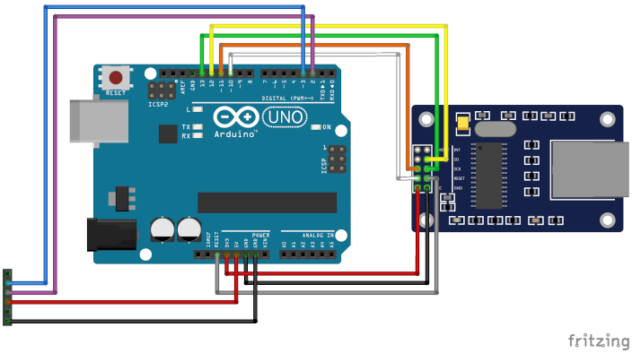

# EtherModem

This is a firmware for Arduino+Ethernet module that emulates an Hayes-compatible modem.

## Wiring

| ENC28J60 | Arduino UNO |
| -------- | ----------- |
|   CS     |     D10     |
|   SI     |     D11     |
|   SO     |     D12     |
|   SCK    |     D13     |
|   RESET  |     RESET   |
|   VCC    |     3.3V    |
|   GND    |     GND     |

Wiring for a standard 6-pin serial connector.

| Serial | Arduino UNO     |
| ------ | --------------- |
|   6    |    N.C.         |
|   5    |    D3           |
|   4    |    D2           |
|   3    |    5V (optional)|
|   2    |    N.C.         |
|   1    |    GND          |

Pin 3 can be used to either power the serial device or the Arduino itself, in that case make sure the device can sustain
both the Arduino and ENC28J60 boards.

## Command set

| Command | Description |
| ------- | ----------- |
| **A**  | Answer incoming call |
| **D**  | Connect (dial) to the following host/ip  Examples:  ATDP n.n.n.n[:port]. Connect to IP addres n.n.n.n. ATDT hostname.com[:port]. Connect to hostname.com.  If not specified, the default port number is 23.|
| **E0** | Will not echo commands to the computer |
| **E1** | Will echo commands to the computer (so one can see what one types if the computer software does not support echo) |
| **H**  | On hook. Hangs up the phone, ending any call in progress. |
| **I0** to **I6** | Inquiry, Information, or Interrogation |
| **L**  | Speaker loudness (ignored, always returns OK). |
| **M**  | Speaker off (ignored, always returns OK). |
| **O**  | Return online. Returns the modem back to the normal connected state after being interrupted by the "+++" escape code. |
| **Q0** or **Q** | Quiet mode off, displays result codes, user sees command responses (e.g. OK) |
| **Q1** | Quiet mode on, result codes are suppressed, user does not see responses. |
| **Sn?** | Display register n value |
| **Sn=r** | Set register n value to r |
| **V0** or **V** | Verbose mode off, display numeric result codes |
| **V1** | Verbose mode on, display english result codes (e.g. CONNECT, NO CARRIER, etc.) |
| **X0** | Disables extended result codes |
| **X1** | Enables extended result codes |
| **Z** | Reset modem to stored configuration |
| **&F** | Restore factory settings |
| **&W** | Store current configuration into eeprom |

When a call is established, type the escape sequence "+++" to switch to command mode.

## Extended commands

| Command | Description |
| ------- | ----------- |
| **+UART=baud,data,stop,parity,flow**  | Serial port configuration.  **baud** - UART baud rate **data** - data bits (5-8) **stop** - stop bits (1-2) **parity** - 0 (none), 1 (odd), 2 (even) **flow** - flow control (ignored) |

## S Register definitions

The firmware allows to set and store all registers from 0 to 255, however only a small number have a meaning.

| Register | Description | Range | Default |
| -------- | ----------- | ----- | ------- |
| **S0**  | Number of rings before Auto-Answer | 0-255 (0=Never) | 0 |
| **S1**  | Ring counter | 0-255 rings | 0 |
| **S2**  | Escape character | 0-255, ASCII decimal | 43 ("+") |
| **S3**  | Carriage Return character | 0-255, ASCII decimal | 13 (Carriage Return) |
| **S4**  | Line Feed character | 0-255, ASCII decimal | 10 (Line Feed) |
| **S5**  | Backspace character | 0-255, ASCII decimal | 8 (Backspace) |
| **S12**  | Escape Code Guard Time | 0–255 fiftieths of a second | 50 (1 second) |
| **S15**  | Telnet Protocol | 0=Disable, 1=Enable | 0 |
| **S37**  | Desired telco line speed. | 0-11 | 0 |

By default the module will send and receive its information as fast as the serial connection baud rate allows.
However, if you want the true nostalgic feel of a slow modem connection, you can limit the speed by setting the
"Desired Telco Line Speed" register (S37). Before dialing, issue the command "AT S37=N" where N is an index
defining the desired baud rate: 0=auto (default), 1=75, 2=110, 3=300, 4=600, 5=1200, 6=2400, 7=4800, 8=7200, 9=9600, 10=12000, 11=14400

## Credits

This firmware is based on the [WifiModem](https://github.com/dhansel/WifiModem) code by David Hansel.

